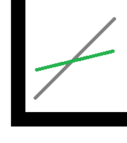

td2a_plotting: simple plotting module
=====================================

This package does nothing except showing how package
a plotting function.

.. toctree::
    :maxdepth: 2

    plots
    auto_examples/index

Sources available on
`github/td2a_plotting <https://github.com/sdpython/td2a_plotting>`_.

*Indices and tables*

* :ref:`genindex`
* :ref:`modindex`
* `Code coverage <coverage.html>`_
